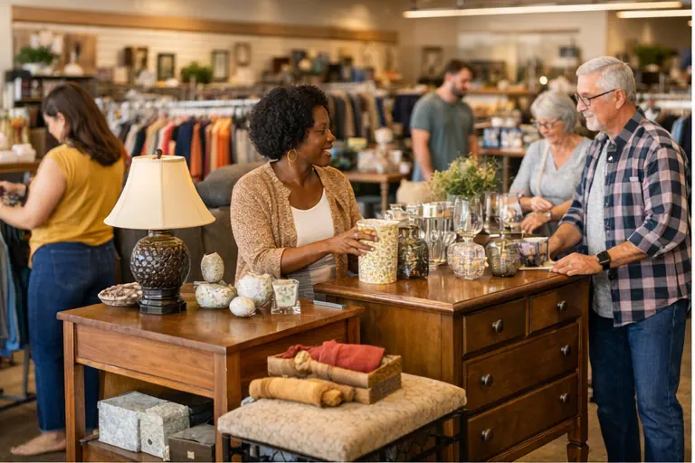

# SuperThrift Image Requirements

The new landing page has placeholder areas for images. To maximize conversions and Google Ads Quality Score, you'll need the following photos.

## Required Images

### 1. Hero Background Image
**Current:** Using `images/superthrift-store.png` (already exists)
**Recommendation:** This is fine, but consider a brighter, more inviting photo of:
- Happy shoppers browsing the store
- Clean, organized store interior
- Donation truck with volunteers

**Specs:** 1920x1080px minimum, JPG or WebP, compressed for web

---

### 2. Donation Section Image
**Location in HTML:** Replace `.donate-placeholder` div
**What to photograph:**
- Donation boxes ready for pickup
- Volunteers loading a truck
- Organized donation drop-off area
- Happy donor handing off items

**Specs:** 700x525px (4:3 ratio), JPG or WebP

**To add:** Replace this HTML in `index.html` (around line 131-135):
```html
<div class="image-placeholder donate-placeholder">
    <span>&#128230;</span>
    <p>Donation Photo</p>
</div>
```
With:
```html

```

---

### 3. Shop Section Image
**Location in HTML:** Replace `.shop-placeholder` div
**What to photograph:**
- Store interior with merchandise displays
- Furniture section
- Clothing racks with quality items
- Customer finding a great deal

**Specs:** 700x525px (4:3 ratio), JPG or WebP

**To add:** Replace this HTML in `index.html` (around line 197-201):
```html
<div class="image-placeholder shop-placeholder">
    <span>&#128722;</span>
    <p>Store Photo</p>
</div>
```
With:
```html

```

---

### 4. Community Impact Image
**Location in HTML:** Replace `.impact-placeholder` div
**What to photograph:**
- Volunteers working together
- Community event or donation drive
- Staff helping customers
- Mercy House team photo

**Specs:** 700x525px (4:3 ratio), JPG or WebP

**To add:** Replace this HTML in `index.html` (around line 212-216):
```html
<div class="image-placeholder impact-placeholder">
    <span>&#129309;</span>
    <p>Community Photo</p>
</div>
```
With:
```html

```

---

## Optional (Nice to Have)

### Mercy House Logo
If you have permission to use the Mercy House logo, add it to the trust strip section for credibility.

### Location-Specific Photos
- Photo of Pearl store exterior
- Photo of Byram store exterior
- These could be added to the location cards

### Testimonial Author Photos
If you have permission from customers/donors who provided testimonials, small headshots would add authenticity.

---

## Image Optimization Tips

1. **Format:** Use WebP for best compression. JPG as fallback.
2. **Compression:** Use tools like TinyPNG, Squoosh, or ImageOptim
3. **File size:** Keep each image under 200KB for fast loading
4. **Alt text:** Always include descriptive alt text for accessibility and SEO
5. **Naming:** Use descriptive filenames (e.g., `donation-pickup.webp` not `IMG_1234.jpg`)

---

## Checklist

- [ ] Hero/store image (optional upgrade)
- [ ] Donation section photo
- [ ] Shop/store interior photo
- [ ] Community impact photo
- [ ] Mercy House logo (if permitted)
- [ ] Location exterior photos (optional)
- [ ] Compress all images for web
- [ ] Test page load speed after adding images
